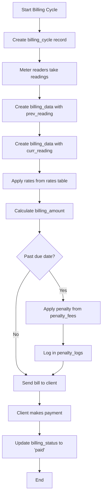

## billing_data Table

Core table storing billing records with meter readings and calculated charges.

### Table Schema

```sql
CREATE TABLE `billing_data` (
  `id` int(11) NOT NULL AUTO_INCREMENT,
  `billing_id` varchar(50) NOT NULL,
  `client_id` varchar(20) NOT NULL,
  `meter_number` varchar(50) NOT NULL,
  `prev_reading` decimal(10,2) NOT NULL DEFAULT 0.00,
  `curr_reading` decimal(10,2) NOT NULL DEFAULT 0.00,
  `reading_type` varchar(20) DEFAULT NULL,
  `consumption` decimal(10,2) NOT NULL DEFAULT 0.00,
  `rates` decimal(7,2) NOT NULL DEFAULT 0.00,
  `rate_type` enum('Commercial','Residential') NOT NULL,
  `rate_fee_id` varchar(50) NOT NULL,
  `billing_amount` decimal(10,2) NOT NULL DEFAULT 0.00,
  `billing_status` enum('initial','unpaid','paid') DEFAULT 'initial',
  `billing_type` enum('initial','unverified','verified','billed','paid','disputed','canceled','overdue') NOT NULL DEFAULT 'initial',
  `penalty` decimal(7,2) NOT NULL DEFAULT 0.00,
  `billing_month` varchar(20) NOT NULL,
  `due_date` date DEFAULT NULL,
  `disconnection_date` date DEFAULT NULL,
  `period_to` date DEFAULT NULL,
  `period_from` date DEFAULT NULL,
  `encoder` varchar(20) NOT NULL,
  `time` time DEFAULT NULL,
  `date` date DEFAULT NULL,
  `timestamp` timestamp NULL DEFAULT NULL,
  `last_update` timestamp NOT NULL DEFAULT current_timestamp(),
  PRIMARY KEY (`id`),
  KEY `client_id` (`client_id`),
  KEY `billing_id` (`billing_id`),
  KEY `meter_number` (`meter_number`)
) ENGINE=InnoDB;
```

### Field Descriptions

<ResponseField name="billing_id" type="varchar(50)">
  Unique billing identifier in format `B-W-NNNNN-TIMESTAMP`
  
  Example: `B-W-89898-1705976220`
</ResponseField>

<ResponseField name="client_id" type="varchar(20)">
  Reference to client record
  
  Example: `WBS-RGV-001012324`
</ResponseField>

<ResponseField name="meter_number" type="varchar(50)">
  Water meter identifier
  
  Example: `W-89898`
</ResponseField>

<ResponseField name="prev_reading" type="decimal(10,2)" default="0.00">
  Previous meter reading in cubic meters
</ResponseField>

<ResponseField name="curr_reading" type="decimal(10,2)" default="0.00">
  Current meter reading in cubic meters
</ResponseField>

<ResponseField name="reading_type" type="varchar(20)">
  Type of reading record
  
  **Values:**
  - `previous` - Previous reading initialization
  - `current` - Current billing period reading
</ResponseField>

<ResponseField name="consumption" type="decimal(10,2)" default="0.00">
  Calculated water consumption (curr_reading - prev_reading)
</ResponseField>

<ResponseField name="rates" type="decimal(7,2)" default="0.00">
  Per cubic meter rate applied to this bill
</ResponseField>

<ResponseField name="rate_type" type="enum" required>
  Property type determining the rate
  
  **Values:**
  - `Commercial` - Commercial property rate
  - `Residential` - Residential property rate
</ResponseField>

<ResponseField name="rate_fee_id" type="varchar(50)">
  Reference to the rates table record used for calculation
  
  Example: `RF20240119124348745`
</ResponseField>

<ResponseField name="billing_amount" type="decimal(10,2)" default="0.00">
  Total billing amount including taxes
</ResponseField>

<ResponseField name="billing_status" type="enum" default="initial">
  Payment status of the bill
  
  **Values:**
  - `initial` - Newly created, not yet finalized
  - `unpaid` - Finalized bill awaiting payment
  - `paid` - Payment received and confirmed
</ResponseField>

<ResponseField name="billing_type" type="enum" default="initial">
  Detailed billing workflow status
  
  **Values:**
  - `initial` - Initial state
  - `unverified` - Reading entered but not verified
  - `verified` - Reading verified
  - `billed` - Bill generated and sent to client
  - `paid` - Payment completed
  - `disputed` - Bill under dispute
  - `canceled` - Bill canceled
  - `overdue` - Past due date
</ResponseField>

<ResponseField name="penalty" type="decimal(7,2)" default="0.00">
  Late payment penalty amount applied
</ResponseField>

<ResponseField name="billing_month" type="varchar(20)" required>
  Billing period identifier
  
  Format: `Month YYYY`
  
  Example: `January 2024`
</ResponseField>

<ResponseField name="due_date" type="date">
  Payment due date
</ResponseField>

<ResponseField name="disconnection_date" type="date">
  Date when service will be disconnected if unpaid
</ResponseField>

<ResponseField name="period_from" type="date">
  Start date of billing period
</ResponseField>

<ResponseField name="period_to" type="date">
  End date of billing period
</ResponseField>

<ResponseField name="encoder" type="varchar(20)" required>
  User who created/encoded the billing record
  
  Example: `Rogene Vito` or `ADMIN_01`
</ResponseField>

### Billing Workflow

1. **Initial Reading** - Previous reading is recorded (`reading_type='previous'`, `billing_status='initial'`)
2. **Current Reading** - Current reading is entered (`reading_type='current'`)
3. **Calculation** - Consumption and billing amount calculated based on rates
4. **Verification** - Bill is verified (`billing_type='verified'`)
5. **Billing** - Bill is sent to client (`billing_type='billed'`, `billing_status='unpaid'`)
6. **Payment** - Payment received (`billing_type='paid'`, `billing_status='paid'`)

---

## billing_cycle Table

Manages billing period configuration and status.

### Table Schema

```sql
CREATE TABLE `billing_cycle` (
  `id` int(11) NOT NULL AUTO_INCREMENT,
  `billing_cycle` varchar(50) NOT NULL,
  `type` enum('ongoing','done','','') NOT NULL,
  `time` time NOT NULL,
  `date` date NOT NULL,
  `timestamp` timestamp NOT NULL DEFAULT current_timestamp() ON UPDATE current_timestamp(),
  PRIMARY KEY (`id`),
  KEY `billing_month` (`billing_cycle`)
) ENGINE=InnoDB;
```

### Field Descriptions

<ResponseField name="billing_cycle" type="varchar(50)" required>
  Billing period name
  
  Format: `Month YYYY`
  
  Example: `November 2023`
</ResponseField>

<ResponseField name="type" type="enum" required>
  Status of the billing cycle
  
  **Values:**
  - `ongoing` - Currently active billing period
  - `done` - Billing period completed
</ResponseField>

<Note>
  Only one billing cycle should have `type='ongoing'` at any given time.
</Note>

---

## rates Table

Stores water rate configurations for different property types and billing periods.

### Table Schema

```sql
CREATE TABLE `rates` (
  `id` int(11) NOT NULL AUTO_INCREMENT,
  `rate_fee_id` varchar(50) NOT NULL,
  `rate_type` varchar(50) NOT NULL,
  `rates` varchar(20) NOT NULL,
  `tax` smallint(6) NOT NULL DEFAULT 2,
  `billing_month` varchar(20) NOT NULL,
  `reference_id` varchar(20) NOT NULL,
  `time` time NOT NULL,
  `date` date NOT NULL,
  `timestamp` timestamp NOT NULL DEFAULT current_timestamp(),
  PRIMARY KEY (`id`)
) ENGINE=InnoDB;
```

### Field Descriptions

<ResponseField name="rate_fee_id" type="varchar(50)" required>
  Unique rate configuration identifier
  
  Format: `RF` + timestamp
  
  Example: `RF20240119124348745`
</ResponseField>

<ResponseField name="rate_type" type="varchar(50)" required>
  Property type for this rate
  
  **Values:**
  - `Commercial` - Commercial property rate
  - `Residential` - Residential property rate
</ResponseField>

<ResponseField name="rates" type="varchar(20)" required>
  Rate per cubic meter of water consumed
  
  Stored as string but represents decimal value
</ResponseField>

<ResponseField name="tax" type="smallint(6)" default="2">
  Tax percentage applied to the bill
  
  Default: 2% (fixed value)
</ResponseField>

<ResponseField name="billing_month" type="varchar(20)" required>
  Billing period this rate applies to
  
  Format: `Month YYYY`
</ResponseField>

<ResponseField name="reference_id" type="varchar(20)" required>
  User ID who configured this rate
</ResponseField>

---

## penalty_fees Table

Configures penalty fees for late payments and reconnections.

### Table Schema

```sql
CREATE TABLE `penalty_fees` (
  `id` int(11) NOT NULL AUTO_INCREMENT,
  `penalty_fee_id` varchar(50) NOT NULL,
  `late_payment_fee` decimal(7,2) NOT NULL,
  `reconnection_fee` decimal(7,2) NOT NULL,
  `reference_id` varchar(20) NOT NULL,
  `time` time NOT NULL,
  `date` date NOT NULL,
  `timestamp` timestamp NOT NULL DEFAULT current_timestamp() ON UPDATE current_timestamp(),
  PRIMARY KEY (`id`)
) ENGINE=InnoDB;
```

### Field Descriptions

<ResponseField name="penalty_fee_id" type="varchar(50)" required>
  Unique penalty fee configuration ID
  
  Format: `PF` + timestamp
  
  Example: `PF20240204220303761`
</ResponseField>

<ResponseField name="late_payment_fee" type="decimal(7,2)" required>
  Fee charged for late payment
</ResponseField>

<ResponseField name="reconnection_fee" type="decimal(7,2)" required>
  Fee charged to reconnect after disconnection
</ResponseField>

<ResponseField name="reference_id" type="varchar(20)" required>
  User ID who configured the penalty fees
</ResponseField>

---

## penalty_logs Table

Records when penalties are applied to specific bills.

### Table Schema

```sql
CREATE TABLE `penalty_logs` (
  `id` int(11) NOT NULL AUTO_INCREMENT,
  `penalty_fee_id` varchar(50) NOT NULL,
  `penalty` decimal(7,2) NOT NULL,
  `billing_id` varchar(50) NOT NULL,
  `billing_month` varchar(50) NOT NULL,
  `time` time NOT NULL,
  `timestamp` timestamp NOT NULL DEFAULT current_timestamp() ON UPDATE current_timestamp(),
  `date` date NOT NULL,
  PRIMARY KEY (`id`)
) ENGINE=InnoDB;
```

### Field Descriptions

<ResponseField name="penalty_fee_id" type="varchar(50)" required>
  Reference to penalty_fees configuration used
</ResponseField>

<ResponseField name="penalty" type="decimal(7,2)" required>
  Actual penalty amount applied
</ResponseField>

<ResponseField name="billing_id" type="varchar(50)" required>
  Reference to billing_data record that received the penalty
</ResponseField>

<ResponseField name="billing_month" type="varchar(50)" required>
  Billing period of the penalized bill
</ResponseField>

## Complete Billing Flow

