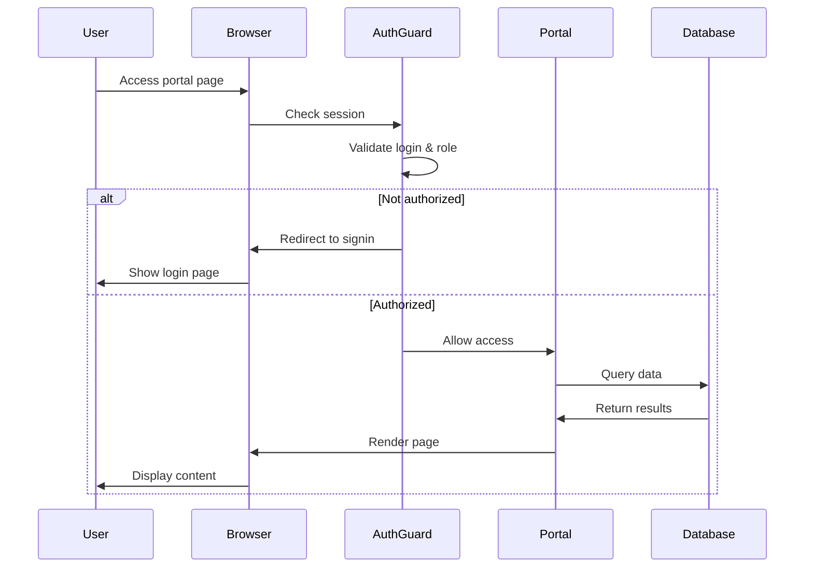

The Roxas Water Billing System follows a multi-portal architecture with role-based access control, separating functionality across three distinct user interfaces.

## Architecture overview

The system is built on a traditional LAMP stack with modern frontend components:

<CardGroup cols={2}>
  <Card title="Backend" icon="server">
    - PHP 7.4+ with MySQLi
    - Object-oriented architecture
    - Prepared statements for security
    - Session-based authentication
  </Card>
  <Card title="Frontend" icon="palette">
    - Tailwind CSS utility framework
    - Flowbite component library
    - ApexCharts for analytics
    - jQuery for DOM manipulation
  </Card>
  <Card title="Database" icon="database">
    - MySQL/MariaDB 10.4+
    - 24 normalized tables
    - Triggers for audit logging
    - Foreign key relationships
  </Card>
  <Card title="Integration" icon="plug">
    - Dompdf for PDF generation
    - PHPMailer with OAuth2
    - QR code generation
    - Google OAuth provider
  </Card>
</CardGroup>

## Three-portal structure

The application is divided into three separate portals, each with its own directory structure and access controls:

```
/admin/          # Administrator portal - full system access
/cashier/        # Cashier portal - payment processing
/meter-reader/   # Meter reader portal - reading management
/authentication/ # Shared authentication system
```

Each portal shares a common architecture but maintains separate:
- Database query classes
- UI components and layouts
- JavaScript modules
- PDF/email templates

## Authentication & authorization

The system uses PHP sessions with role-based access control.

### Session management

When users sign in, their role is stored in the session:

```php authentication/signin_process.php
$_SESSION['loggedin'] = true;
$_SESSION['user_id'] = $user_id;
$_SESSION['user_role'] = $role; // "Admin", "Cashier", or "Meter Reader"
$_SESSION['user_name'] = $full_name;
```

### Access guards

Each portal protects its pages with an auth guard that checks both login status and role:

```php admin/auth_guard.php
<?php
session_start();
if (!isset($_SESSION['loggedin'])) {
    echo '<script>alert("Please log in first!");</script>';
    echo '<script>window.location.href = "../authentication/signin.php";</script>';
    exit;
}

if ($_SESSION['user_role'] != "Admin") {
    echo '<script>alert("You\'re not allowed here!");</script>';
    $_SESSION = array();
    session_unset();
    session_destroy();
    echo '<script>window.location.href = "../authentication/signin.php";</script>';
}
```

<Warning>
Each portal has its own auth_guard.php that checks for the appropriate role. Attempting to access a portal without the correct role clears the session and redirects to signin.
</Warning>

## Database layer

### DatabaseConnection class

All database operations use a centralized connection class:

```php admin/database/Database.php
namespace Admin\Database;

class DatabaseConnection
{
    protected $connection;

    public function __construct($host, $username, $password, $database)
    {
        $this->connection = new \mysqli($host, $username, $password, $database);

        if ($this->connection->connect_error) {
            die("Connection failed: " . $this->connection->connect_error);
        }
    }

    public function prepareStatement($sql)
    {
        return $this->connection->prepare($sql);
    }

    public function beginTransaction()
    {
        return $this->connection->begin_transaction();
    }

    public function commitTransaction()
    {
        return $this->connection->commit();
    }

    public function rollbackTransaction()
    {
        return $this->connection->rollback();
    }
}
```

### BaseQuery pattern

Query classes extend BaseQuery to inherit database connection:

```php
class BaseQuery
{
    protected $conn;

    public function __construct(DatabaseConnection $databaseConnection)
    {
        $this->conn = $databaseConnection;
    }
}

class PdfGenerator extends BaseQuery { /* ... */ }
class WBSMailer extends PdfGenerator { /* ... */ }
```

This inheritance chain allows specialized classes to access database operations while maintaining separation of concerns.

## Security features

<Accordion title="Prepared statements">
All database queries use prepared statements with parameter binding:

```php
$sql = "SELECT * FROM client_data WHERE client_id = ?";
$stmt = $this->conn->prepareStatement($sql);
mysqli_stmt_bind_param($stmt, "s", $clientID);
mysqli_stmt_execute($stmt);
```
</Accordion>

<Accordion title="Session security">
- Sessions are validated on every protected page
- Role mismatch triggers session destruction
- No client-side role storage
</Accordion>

<Accordion title="Input validation">
- Client-side validation with validate.js
- Server-side sanitization in PHP
- Type checking and format validation
</Accordion>

<Accordion title="Audit logging">
- Database triggers log all changes
- User activity tracked in logs table
- Email sending recorded in email_logs
</Accordion>

## Request flow



## Component architecture

Each portal follows a consistent component structure:

- **Pages** - Top-level PHP files (e.g., `dashboard.php`, `clients.php`)
- **Layouts** - Reusable UI structure (header, sidebar, navigation)
- **Components** - Page-specific UI modules (`*_main.php` files)
- **Templates** - PDF and email HTML templates
- **Assets** - JavaScript modules and CSS

<Info>
The `components/` directory contains the main content for each page, while the top-level page file includes the layout and component together.
</Info>

## Next steps

<CardGroup cols={2}>
  <Card title="File structure" icon="folder-tree" href="/development/file-structure">
    Explore the directory organization
  </Card>
  <Card title="Frontend" icon="paintbrush" href="/development/frontend">
    Learn about UI components and styling
  </Card>
  <Card title="Database queries" icon="database" href="/development/database-queries">
    Understand query patterns
  </Card>
  <Card title="PDF generation" icon="file-pdf" href="/development/pdf-generation">
    Document generation system
  </Card>
</CardGroup>