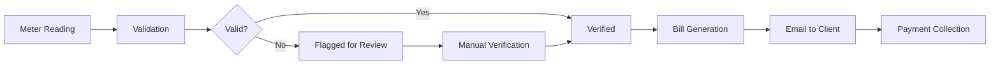

Meter readers are responsible for collecting water meter readings from clients and encoding them into the system for billing calculation.

## Meter Reader Role

Meter readers have access to a dedicated interface at `/meter-reader/` with the following capabilities:

<CardGroup cols={2}>
  <Card title="Encode Readings" icon="keyboard">
    Enter meter readings for assigned clients
  </Card>
  
  <Card title="View Recent Readings" icon="clock">
    Review recently submitted readings
  </Card>
  
  <Card title="Verify Readings" icon="check-double">
    Verify and confirm reading accuracy
  </Card>
  
  <Card title="Generate Bills" icon="file-invoice">
    Trigger bill generation after verification
  </Card>
</CardGroup>

## Reading Collection Workflow

<Steps>
  <Step title="Access Client List">
    Meter readers access the encode meter reading page which displays:
    - List of clients assigned for reading
    - Client ID and name
    - Meter number
    - Property address
    - Previous reading
    - Last reading date
    
    <CodeGroup>
    ```php meter-reader/encode_meter_reading.php
    <?php include './components/encode_meter_reading_main.php'; ?>
    ```
    
    ```php meter-reader/components/encode_meter_reading_main.php
    <div id="displayClientForReadingEncoding"></div>
    ```
    </CodeGroup>
  </Step>

  <Step title="Record Meter Reading">
    For each client, the meter reader:
    1. Physically visits the property
    2. Records the current meter reading
    3. Notes any issues or anomalies
    4. Takes photos if needed (for verification)
    
    <Info>
    Meter readings should be recorded during the same period each month for consistency.
    </Info>
  </Step>

  <Step title="Encode Reading">
    The meter reader enters the reading into the system:
    
    **Required Fields:**
    - Client ID
    - Meter Number
    - Current Reading
    - Reading Date
    - Reading Type (regular/special/final)
    
    The system automatically:
    - Retrieves previous reading
    - Calculates consumption (current - previous)
    - Validates reading (checks for anomalies)
    
    <CodeGroup>
    ```javascript meter-reader/assets/js/EncodeHandler.js
    // Encode reading handler
    $('#encodeReadingForm').on('submit', function(e) {
      e.preventDefault();
      const formData = $(this).serialize();
      
      $.ajax({
        url: 'database_actions.php',
        type: 'POST',
        data: formData,
        success: function(response) {
          // Handle success
        }
      });
    });
    ```
    </CodeGroup>
  </Step>

  <Step title="System Validation">
    The system performs automatic validation:
    
    **Validation Checks:**
    - Current reading ≥ previous reading
    - Consumption within normal range
    - Meter number matches client record
    - No duplicate readings for the period
    
    <Warning>
    If validation fails, the reading is flagged for review and marked as "unverified".
    </Warning>
  </Step>

  <Step title="Verification">
    Readings marked as unverified require additional verification:
    
    Access verification page: `meter-reader/verify_meter_reading.php`
    
    <CodeGroup>
    ```php meter-reader/verify_meter_reading.php
    <?php
    include './database/connection.php';
    include './auth_guard.php';
    ?>
    <!DOCTYPE html>
    <html lang="en">
    <head>
      <title>Verify Meter Reading</title>
    </head>
    <body>
      <!-- Verification interface -->
    </body>
    </html>
    ```
    </CodeGroup>
  </Step>
</Steps>

## Reading Types

The system supports different reading types:

<Tabs>
  <Tab title="Regular Reading">
    **Regular Monthly Reading**
    
    Standard monthly meter reading for active clients.
    
    - Scheduled during billing period
    - Used for normal billing calculation
    - Most common reading type
  </Tab>
  
  <Tab title="Special Reading">
    **Special/Interim Reading**
    
    Taken outside the normal billing cycle.
    
    Use cases:
    - New connection mid-cycle
    - Client request for bill adjustment
    - Suspected meter malfunction
    - Property ownership transfer
  </Tab>
  
  <Tab title="Final Reading">
    **Final Reading**
    
    Last reading before service disconnection.
    
    - Taken when client terminates service
    - Used for final bill calculation
    - Meter may be removed after this reading
  </Tab>
</Tabs>

## Anomaly Detection

The system automatically flags readings with anomalies:

<CardGroup cols={2}>
  <Card title="Zero Consumption" icon="0">
    Current reading equals previous reading
    
    **Possible Causes:**
    - No water usage (vacation, vacant property)
    - Meter malfunction
    - Incorrect reading
  </Card>
  
  <Card title="High Consumption" icon="arrow-up">
    Consumption significantly higher than average
    
    **Possible Causes:**
    - Leak in the system
    - Seasonal increase (summer)
    - Special events
    - Reading error
  </Card>
  
  <Card title="Negative Reading" icon="minus">
    Current reading less than previous reading
    
    **Possible Causes:**
    - Meter replaced
    - Data entry error
    - Meter rolled over (rare)
  </Card>
  
  <Card title="Unusual Pattern" icon="chart-line-up">
    Consumption pattern differs from historical data
    
    **Requires:**
    - Manual review
    - Possible re-reading
    - Client contact
  </Card>
</CardGroup>

### Flagging Clients

Meter readers can flag clients for special attention:

<CodeGroup>
```php meter-reader/components/modal/flag_client_modal.php
<!-- Modal for flagging clients with issues -->
<div id="flagClientModal">
  <form id="flagClientForm">
    <select name="flagReason">
      <option value="meter_malfunction">Meter Malfunction</option>
      <option value="inaccessible">Property Inaccessible</option>
      <option value="suspicious_reading">Suspicious Reading</option>
      <option value="leak_detected">Leak Detected</option>
    </select>
    <textarea name="notes" placeholder="Additional notes..."></textarea>
  </form>
</div>
```

```javascript meter-reader/assets/js/flagClientHandler.js
// Handle client flagging
$('#flagClientForm').on('submit', function(e) {
  e.preventDefault();
  // Submit flag to database
});
```
</CodeGroup>

## Bill Generation Process

After readings are verified, bills are generated:

<Steps>
  <Step title="Trigger Generation">
    Meter readers or admins can trigger bill generation for verified readings.
    
    <CodeGroup>
    ```php meter-reader/bill_generation.php
    if (isset($_POST['action'])) {
      $action = $_POST['action'];
      handleAction($action, $pdfGenerator, $wbsMailer);
    }
    
    switch ($action) {
      case 'sendIndividualBilling':
        handleSendIndividualBilling($wbsMailer);
        break;
    }
    ```
    </CodeGroup>
  </Step>

  <Step title="Calculate Billing">
    System calculates:
    - Consumption (current - previous reading)
    - Applicable rate based on property type
    - Tax (2% fixed)
    - Penalties (if applicable)
    - Total amount due
  </Step>

  <Step title="Generate PDF Bill">
    PDF bill is generated with:
    - Client information
    - Meter readings (previous and current)
    - Consumption amount
    - Rate breakdown
    - Due date
    - QR code for payment
    
    <CodeGroup>
    ```php meter-reader/bill_handler.php
    class PdfGenerator extends BaseQuery {
      public function generateBillingReceipt($receiptData) {
        // Generate PDF using Dompdf
      }
    }
    ```
    </CodeGroup>
  </Step>

  <Step title="Email to Client">
    Bill is automatically emailed to client's registered email address.
    
    <CodeGroup>
    ```php meter-reader/bill_generation.php
    function handleSendIndividualBilling($wbsMailer) {
      $sendIndividualBill = $wbsMailer->sendIndividualBilling();
      echo json_encode($sendIndividualBill);
    }
    ```
    </CodeGroup>
  </Step>

  <Step title="Update Billing Status">
    Billing record status updated from 'verified' to 'billed'
  </Step>
</Steps>

## Recent Readings

Meter readers can view their recent submissions:

<CodeGroup>
```php meter-reader/recent_meter_reading.php
<?php
include './database/connection.php';
include './auth_guard.php';
?>
<!DOCTYPE html>
<html lang="en">
<head>
  <title>Recent Meter Readings</title>
</head>
<body>
  <!-- Display recent readings with:
       - Reading date
       - Client name
       - Meter number
       - Reading value
       - Consumption
       - Status (verified/unverified)
  -->
</body>
</html>
```
</CodeGroup>

## Reading Logs

All meter reading activities are logged for audit purposes:

<CardGroup cols={2}>
  <Card title="Meter Reading Logs" icon="list">
    Track all reading submissions:
    - Who entered the reading
    - When it was entered
    - Original vs modified values
    - Verification status
  </Card>
  
  <Card title="Access Logs" icon="clipboard-check">
    View reading submission history:
    - Available at `meter-reader/display_logs_table.php`
    - Filterable by date, client, reader
    - Exportable for reporting
  </Card>
</CardGroup>

## Mobile Considerations

<Info>
The meter reader interface is responsive and works on mobile devices, allowing field staff to encode readings on-site using tablets or smartphones.
</Info>

**Best Practices for Mobile Reading:**
- Use tablet with cellular/wifi connection
- Verify reading before submitting
- Take photos of meter for documentation
- Note any access issues immediately
- Submit readings within 24 hours of collection

## Integration with Billing

Meter readings flow directly into the billing system:



<Warning>
Only verified readings trigger bill generation. Unverified readings must be manually reviewed and approved before billing.
</Warning>

## Next Steps

<CardGroup cols={2}>
  <Card title="Billing System" icon="file-invoice-dollar" href="/features/billing-system">
    Learn how bills are calculated from meter readings
  </Card>
  
  <Card title="Payment Processing" icon="cash-register" href="/features/payment-processing">
    See how clients pay their bills
  </Card>
</CardGroup>