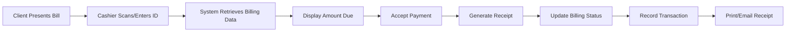

Cashiers process payments from clients for water bills and application fees through a dedicated payment confirmation interface.

## Cashier Role

Cashiers access the system at `/cashier/` with capabilities for:

<CardGroup cols={2}>
  <Card title="Accept Payments" icon="cash-register">
    Process bill and application payments from clients
  </Card>
  
  <Card title="Generate Receipts" icon="receipt">
    Issue payment receipts with QR codes
  </Card>
  
  <Card title="View Transactions" icon="list">
    Review payment history and transaction records
  </Card>
  
  <Card title="Generate Reports" icon="chart-bar">
    Create daily/monthly collection reports
  </Card>
</CardGroup>

## Payment Types

The system handles two primary payment types:

<Tabs>
  <Tab title="Bill Payment">
    **Water Bill Payment**
    
    Payment for monthly water consumption bills.
    
    **Process:**
    1. Client provides account/client ID
    2. Cashier retrieves billing information
    3. System displays amount due (including penalties)
    4. Client makes payment
    5. Cashier confirms payment
    6. Receipt is generated
    7. Billing status updated to 'paid'
    
    <CodeGroup>
    ```php cashier/billing_payments.php
    <?php
    include './database/connection.php';
    include './auth_guard.php';
    ?>
    <!DOCTYPE html>
    <html lang="en">
    <head>
      <title>Payments</title>
      <?php include './layouts/links.php'; ?>
    </head>
    <body>
      <?php include './components/modal/acceptBillingPaymentModal.php'; ?>
      <?php include './components/modal/qrBillPaymentModal.php'; ?>
      <main>
        <?php include './components/billing_payments_main.php'; ?>
      </main>
      <script type="module" src="./assets/js/acceptBillingPayment.js"></script>
    </body>
    </html>
    ```
    </CodeGroup>
  </Tab>
  
  <Tab title="Application Payment">
    **Client Application Fee Payment**
    
    Payment for new water service connection application.
    
    **Process:**
    1. Client submits application
    2. Application fee is calculated
    3. Client pays application fee to cashier
    4. Cashier confirms payment
    5. Receipt issued
    6. Application status updated to 'confirmed'
    7. Application forwarded for approval
    
    <CodeGroup>
    ```php cashier/application_payments.php
    // Handle application fee payments
    <?php include './components/application_payments_main.php'; ?>
    ```
    </CodeGroup>
  </Tab>
</Tabs>

## Payment Workflow

<Steps>
  <Step title="Client Lookup">
    Cashier searches for client by:
    - Client ID
    - Meter Number
    - Name
    - QR Code scan
    
    <CodeGroup>
    ```php cashier/database_actions.php
    case 'checkClientIDExistence':
      handleCheckClientIDExistence($dbQueries);
      break;
    
    function handleCheckClientIDExistence($dbQueries) {
      if (isset($_POST['clientID'])) {
        $clientID = $_POST['clientID'];
        $checkClientIDExistence = $dbQueries->checkClientIDExistence($clientID);
        echo json_encode($checkClientIDExistence);
      }
    }
    ```
    </CodeGroup>
  </Step>

  <Step title="Retrieve Billing Information">
    System retrieves outstanding bills for the client:
    
    **Displayed Information:**
    - Billing ID
    - Billing month
    - Consumption amount
    - Base billing amount
    - Tax (2%)
    - Penalties (if overdue)
    - Total amount due
    - Due date
    - Disconnection date
    
    <CodeGroup>
    ```php cashier/database_actions.php
    case 'retrieveBillingData':
      handleRetrieveBillingData($dbQueries);
      break;
    
    function handleRetrieveBillingData($dbQueries) {
      if (isset($_POST['clientID'])) {
        $clientID = $_POST['clientID'];
        $retrieveBillingData = $dbQueries->retrieveBillingData($clientID);
        echo json_encode($retrieveBillingData);
      }
    }
    ```
    </CodeGroup>
  </Step>

  <Step title="Retrieve Rate Information">
    System retrieves applicable rates for validation:
    
    <CodeGroup>
    ```php cashier/database_actions.php
    case 'retrieveBillingRates':
      handleRetrieveBillingRates($dbQueries);
      break;
    
    function handleRetrieveBillingRates($dbQueries) {
      $retrieveBillingRates = $dbQueries->retrieveBillingRates();
      echo json_encode($retrieveBillingRates);
    }
    ```
    </CodeGroup>
  </Step>

  <Step title="Accept Payment">
    Cashier accepts payment from client:
    
    **Payment Methods:**
    - Cash
    - Check (with check number)
    - Bank transfer (with reference number)
    
    Cashier enters:
    - Amount received
    - Payment method
    - Reference number (if applicable)
    - Change given (for cash)
  </Step>

  <Step title="Confirm Payment">
    Payment is confirmed and recorded in the system.
    
    <CodeGroup>
    ```php cashier/database_actions.php
    case 'confirmBillingPayment':
      handleConfirmBillingPayment($dbQueries);
      break;
    
    function handleConfirmBillingPayment($dbQueries) {
      if (isset($_POST['formData'])) {
        $formData = $_POST['formData'];
        $confirmBillPayment = $dbQueries->confirmBillingPayment($formData);
        echo json_encode($confirmBillPayment);
      }
    }
    ```
    </CodeGroup>
    
    <Info>
    All form data is sanitized using `htmlspecialchars()` to prevent security vulnerabilities.
    </Info>
  </Step>

  <Step title="Generate Receipt">
    System automatically generates a payment receipt with:
    - Receipt number
    - Date and time
    - Client information
    - Billing details
    - Amount paid
    - Payment method
    - Cashier name
    - QR code for verification
  </Step>

  <Step title="Update Records">
    Multiple database updates occur:
    
    **billing_data table:**
    - `billing_status` → 'paid'
    - `billing_type` → 'paid'
    
    **transactions table:**
    - New transaction record created
    - Transaction type: 'bill_payment' or 'application_payment'
    - Amount, date, cashier ID recorded
    
    **client_data table:**
    - Last payment date updated
    - Account status updated if applicable
  </Step>
</Steps>

## Payment Confirmation Modal

Cashiers use a modal interface to confirm payments:

<CodeGroup>
```php cashier/components/modal/acceptBillingPaymentModal.php
<div id="acceptBillingPaymentModal">
  <form id="billingPaymentForm">
    <!-- Client Info Display -->
    <div class="client-info">
      <p>Client ID: <span id="clientID"></span></p>
      <p>Name: <span id="clientName"></span></p>
      <p>Meter Number: <span id="meterNumber"></span></p>
    </div>
    
    <!-- Billing Info Display -->
    <div class="billing-info">
      <p>Billing Month: <span id="billingMonth"></span></p>
      <p>Consumption: <span id="consumption"></span> m³</p>
      <p>Base Amount: ₱<span id="baseAmount"></span></p>
      <p>Tax (2%): ₱<span id="tax"></span></p>
      <p>Penalty: ₱<span id="penalty"></span></p>
      <p class="total">Total Due: ₱<span id="totalDue"></span></p>
    </div>
    
    <!-- Payment Input -->
    <div class="payment-input">
      <input type="number" name="amountReceived" placeholder="Amount Received" step="0.01" required>
      <select name="paymentMethod">
        <option value="cash">Cash</option>
        <option value="check">Check</option>
        <option value="bank_transfer">Bank Transfer</option>
      </select>
      <input type="text" name="referenceNumber" placeholder="Reference Number (optional)">
    </div>
    
    <button type="submit">Confirm Payment</button>
  </form>
</div>
```

```javascript cashier/assets/js/acceptBillingPayment.js
// Handle billing payment confirmation
import { confirmPayment } from './paymentHandler.js';

$('#billingPaymentForm').on('submit', function(e) {
  e.preventDefault();
  
  const formData = {
    clientID: $('#clientID').text(),
    billingID: $('#billingID').val(),
    amountReceived: $('input[name="amountReceived"]').val(),
    paymentMethod: $('select[name="paymentMethod"]').val(),
    referenceNumber: $('input[name="referenceNumber"]').val(),
    cashierID: sessionStorage.getItem('userID')
  };
  
  confirmPayment(formData);
});
```
</CodeGroup>

## QR Code Payment

Clients can present QR codes from their bills for quick payment processing:

<CardGroup cols={2}>
  <Card title="Scan QR Code" icon="qrcode">
    Cashier scans QR code using device camera or scanner
  </Card>
  
  <Card title="Auto-Load Data" icon="bolt">
    System automatically loads client and billing information
  </Card>
</CardGroup>

<CodeGroup>
```php cashier/components/modal/qrBillPaymentModal.php
<div id="qrBillPaymentModal">
  <div id="qr-reader" style="width: 500px;"></div>
  <div id="qr-result"></div>
</div>
```

```html cashier/billing_payments.php
<script src="./assets/libs/html5-qrcode/html5-qrcode.min.js"></script>
<script>
  // Initialize QR code scanner
  const html5QrCode = new Html5Qrcode("qr-reader");
  
  html5QrCode.start(
    { facingMode: "environment" },
    { fps: 10, qrbox: 250 },
    (decodedText) => {
      // Load billing data from scanned code
      loadBillingDataFromQR(decodedText);
    }
  );
</script>
```
</CodeGroup>

## Receipt Generation

Receipts are generated as PDF documents with comprehensive information:

<CodeGroup>
```php cashier/database_queries.php
class PdfGenerator extends BaseQuery {
  public function generateBillingReceipt($receiptData) {
    $options = new Options();
    $options->setChroot(__DIR__);
    $options->setIsRemoteEnabled(true);
    $dompdf = new Dompdf($options);
    
    // Generate QR code for receipt verification
    $qrCode = new QrCode($receiptData['no']);
    $writer = new PngWriter();
    $result = $writer->write($qrCode);
    $qrDataUri = $result->getDataUri();
    
    // Extract receipt data
    $no = $receiptData['no'];
    $date = date("Y-m-d");
    $accountNo = $receiptData['account_no'];
    $consumption = $receiptData['consumption'];
    $penalty = $receiptData['penalty'];
    $tax = $receiptData['tax'];
    $amountDue = $receiptData['amount_due'];
    $cashier = $receiptData['cashier'];
    
    // Generate PDF
    $dompdf->loadHtml($html);
    $dompdf->render();
    
    return $dompdf->output();
  }
}
```
</CodeGroup>

**Receipt Contains:**
- Receipt number (unique)
- Date and time of payment
- Client ID and name
- Meter number
- Address
- Billing period
- Consumption amount
- Rate breakdown
- Tax amount
- Penalty (if any)
- Total paid
- Payment method
- Cashier name
- QR code for verification

<Info>
Receipts can be printed immediately or emailed to the client's registered email address.
</Info>

## Transaction Recording

All payments are recorded in the `transactions` table:

<CodeGroup>
```sql transactions table
CREATE TABLE `transactions` (
  `id` int(11) NOT NULL AUTO_INCREMENT,
  `transaction_id` varchar(50) NOT NULL,
  `client_id` varchar(20) NOT NULL,
  `billing_id` varchar(50),
  `transaction_type` enum('bill_payment','application_payment') NOT NULL,
  `amount_due` decimal(10,2) NOT NULL,
  `payment_method` varchar(20) NOT NULL,
  `reference_number` varchar(50),
  `cashier_id` varchar(20) NOT NULL,
  `date` date NOT NULL,
  `time` time NOT NULL,
  `timestamp` timestamp NOT NULL DEFAULT current_timestamp(),
  PRIMARY KEY (`id`)
);
```
</CodeGroup>

## Payment Tables and Views

Cashiers can view payment data through organized tables:

<Tabs>
  <Tab title="Billing Payments">
    View all billing payment transactions:
    - Client information
    - Billing details
    - Payment amount
    - Payment date
    - Cashier who processed
    - Payment status
    
    <CodeGroup>
    ```php cashier/database_actions.php
    case 'getDataTable':
      handleGetDataTable($dataTable);
      break;
    
    function handleGetDataTable($dataTable) {
      switch ($tableName) {
        case "billing_data":
          $dataTable->billingTable($dataTableParam);
          break;
      }
    }
    ```
    </CodeGroup>
  </Tab>
  
  <Tab title="Application Payments">
    View application fee payments:
    - Application ID
    - Applicant name
    - Fee amount
    - Payment date
    - Status
    
    <CodeGroup>
    ```php cashier/database_actions.php
    case "client_application":
      $dataTable->clientAppBillingTable($dataTableParam);
      break;
    ```
    </CodeGroup>
  </Tab>
  
  <Tab title="All Transactions">
    Complete transaction history accessible via:
    - `cashier/transactions.php`
    - Filterable by date range, payment type
    - Exportable for reporting
  </Tab>
</Tabs>

## Collection Reports

Cashiers can generate collection reports:

<CardGroup cols={2}>
  <Card title="Daily Collection" icon="calendar-day">
    Total payments collected for the current day
    
    Breakdown by:
    - Payment type
    - Payment method
    - Cashier
  </Card>
  
  <Card title="Monthly Collection" icon="calendar">
    Monthly revenue from payments
    
    Analysis by:
    - Application fees vs bill payments
    - Payment trends
    - Outstanding amounts
  </Card>
</CardGroup>

<CodeGroup>
```php cashier/reports.php
<?php
include './database/connection.php';
include './auth_guard.php';
?>
<!DOCTYPE html>
<html lang="en">
<head>
  <title>Reports</title>
</head>
<body>
  <main>
    <!-- Collection reports interface -->
  </main>
</body>
</html>
```
</CodeGroup>

## Notifications

Cashiers receive notifications for:
- Pending payments
- Failed transactions
- System alerts

<CodeGroup>
```php cashier/database_actions.php
case 'loadNotification':
  handleLoadNotification($dbQueries);
  break;

function handleLoadNotification($dbQueries) {
  if (isset($_POST['limit'])) {
    $limit = $_POST['limit'];
    $dbQueries->loadNotificationHtml($limit);
  }
}

case 'countUnreadNotifications':
  handleCountUnreadNotification($dbQueries);
  break;
```
</CodeGroup>

## Security Features

<CardGroup cols={2}>
  <Card title="Input Sanitization" icon="shield">
    All inputs sanitized using `htmlspecialchars()` to prevent XSS
  </Card>
  
  <Card title="Authentication" icon="lock">
    Cashier login required via `auth_guard.php`
  </Card>
  
  <Card title="Transaction Logging" icon="clipboard-list">
    All payment actions logged with:
    - Cashier ID
    - Timestamp
    - IP address
    - Action performed
  </Card>
  
  <Card title="Receipt Verification" icon="check-circle">
    QR codes enable receipt authenticity verification
  </Card>
</CardGroup>

<Warning>
Cashiers cannot delete or modify completed transactions. All payment records are permanent for audit compliance.
</Warning>

## Integration Flow



## Next Steps

<CardGroup cols={2}>
  <Card title="Reports & Analytics" icon="chart-line" href="/features/reports-analytics">
    View payment collection analytics and trends
  </Card>
  
  <Card title="Billing System" icon="file-invoice-dollar" href="/features/billing-system">
    Understand how bills are generated
  </Card>
</CardGroup>