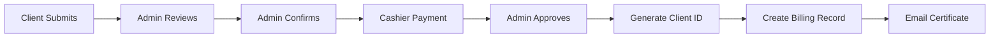

## Overview

The Administrator portal (`/admin/`) is the central command center of the Roxas Water Billing System. Administrators have complete system access with permissions to manage clients, oversee billing operations, configure rates and charges, generate reports, and monitor all system activities.

<CardGroup cols={2}>
  <Card title="Client Management" icon="users">
    Complete control over client accounts, applications, and profile updates
  </Card>
  <Card title="Billing Oversight" icon="file-invoice">
    Monitor all billing operations, transactions, and payment confirmations
  </Card>
  <Card title="Rates & Charges" icon="money-bill">
    Configure water rates, application fees, and penalty charges
  </Card>
  <Card title="Reports & Analytics" icon="chart-line">
    Generate comprehensive reports and view system-wide analytics
  </Card>
</CardGroup>

## Dashboard Features

The admin dashboard (`dashboard.php`) provides real-time system metrics and visualizations:

### Key Performance Indicators

- **Total Clients**: Track active, inactive, and under-review client statuses
- **Total Revenue**: Monitor revenue from application fees and billing payments
- **Total Applications**: View unconfirmed and approved application counts
- **Total Consumption**: Measure water usage across commercial and residential properties

### Analytics & Visualizations

<AccordionGroup>
  <Accordion title="Client Distribution (Pie Chart)">
    Displays the percentage of clients per barangay, helping identify service coverage patterns and plan infrastructure expansion.
  </Accordion>
  
  <Accordion title="Revenue Trends (Bar Chart)">
    Shows revenue generated by the system over time, tracking both application and billing payment income streams.
  </Accordion>
  
  <Accordion title="Consumption Analysis (Line Chart)">
    Visualizes consumption trends based on monthly usage, allowing for demand forecasting and capacity planning.
  </Accordion>
</AccordionGroup>

## Core Responsibilities

### 1. Client Management

**Location**: `clients.php`

Administrators manage the complete client lifecycle:

- **Create New Clients**: Process new client applications and assign unique client IDs (format: `WBS-[Initials]-[Number][Date]`)
- **Update Client Profiles**: Modify client information including meter numbers, property types, addresses, and contact details
- **Monitor Client Status**: Track active, inactive, and flagged accounts
- **Application Review**: Review and approve client applications from the application queue

<Note>
The system generates unique client IDs using the formula: `WBS-[FirstInitial][MiddleInitial][LastInitial]-[PaddedNumber][MMDDYY]`
</Note>

### 2. Client Application Processing

**Location**: `client_application_form.php`, `clients_application_table.php`

Administrators handle new connection applications:

**Application Workflow**:
1. Review submitted applications with status `unconfirmed`
2. Verify required documents (valid ID, proof of ownership, deed of sale, affidavit)
3. Confirm application details and update status to `confirmed`
4. Wait for cashier payment confirmation
5. Approve application and generate client account
6. Generate and email registration certificate (PDF)

**Application Fee Components** (configured in `charges.php`):
- Application Fee
- Inspection Fee
- Registration Fee
- Connection Fee
- Installation Fee

### 3. Billing Management

**Location**: `billing.php`

Monitor and oversee all billing operations:

- View billing records across all clients
- Track billing statuses (initial, billed, paid, overdue)
- Monitor meter readings and consumption calculations
- Review penalty applications for late payments
- Access disconnection notices for non-payment

### 4. Rates & Charges Configuration

#### Water Rates (`rates.php`)

Set consumption rates by property type:
- **Residential Rate**: Per cubic meter pricing for residential properties
- **Commercial Rate**: Per cubic meter pricing for commercial properties
- **Billing Month**: Effective period for rate changes

<CodeGroup>
```php rates.php:1116
public function updateRates($formData)
{
    $ratesID = "RF" . date("YmdHis") . rand(100, 999);
    $propertyType = htmlspecialchars($formData['propertyType'], ENT_QUOTES, 'UTF-8');
    $rates = filter_var($formData['rates'], FILTER_VALIDATE_FLOAT);
    $currentMonthYear = date('F Y');
    
    $sql = "INSERT into rates(rate_fee_id, rate_type, rates, billing_month, reference_id, time, date, timestamp) VALUES(?,?, ?, ?, ?, CURRENT_TIME, CURRENT_DATE, CURRENT_TIMESTAMP)";
}
```
</CodeGroup>

#### Application Fees (`charges.php`)

Configure one-time application charges:
- Application Fee
- Inspection Fee
- Registration Fee
- Connection Fee
- Installation Fee

#### Penalty Fees (`penalty.php`)

Set penalty charges for violations:
- Late Payment Fee
- Reconnection Fee (after disconnection)

### 5. Transaction History

**Location**: `transactions.php`

Comprehensive transaction log showing:
- Transaction ID and type (application_payment, bill_payment)
- Reference ID (links to application or billing ID)
- Client ID and description
- Amount due, amount paid, and remaining balance
- Confirmation details (user and timestamp)

### 6. Report Generation

**Location**: `reports.php`, `report_generation.php`

Generate detailed reports for analysis:

- **Client Reports**: Demographics, property types, status distribution
- **Billing Reports**: Payment history, outstanding balances, collection rates
- **Transaction Reports**: Revenue analysis by date range and transaction type
- **Consumption Reports**: Usage patterns by barangay and property type
- **Meter Reading Reports**: Reading history and consumption trends

<Card title="PDF Export" icon="file-pdf">
Reports can be generated as PDF documents via `generate_pdf.php` using the Dompdf library.
</Card>

### 7. Meter Reports

**Location**: `meter_reports.php`

View detailed meter reading information:
- Reading history by client
- Flagged meters (unusually high/low consumption)
- Reading verification status
- Encoder information and timestamps

### 8. System Logs

**Location**: `logs.php`

Audit trail of system activities:
- User actions and timestamps
- Application approvals and rejections
- Billing confirmations
- Rate and fee changes
- Client profile modifications

## Notification System

Administrators receive notifications for:

<Steps>
  <Step title="Payment Confirmations">
    Alerts when cashiers confirm application payments, triggering the approval workflow
  </Step>
  <Step title="Application Submissions">
    New client applications awaiting review and confirmation
  </Step>
  <Step title="Billing Updates">
    Meter reading submissions and billing generation events
  </Step>
</Steps>

<CodeGroup>
```php database_queries.php:962
public function loadNotificationHtml($limit)
{
    $sql = "SELECT * FROM notifications WHERE status = 'unread' AND type = 'payment_confirmation' ORDER BY created_at DESC";
    // Displays notification icon, message, and time ago
    // Links to client_application_review.php for action
}
```
</CodeGroup>

## Key Workflows

### Application Approval Workflow



### Rate Configuration Workflow

1. Navigate to Management → Rates
2. Select property type (Residential/Commercial)
3. Enter new rate per cubic meter
4. System timestamps change with current month
5. New rate applies to future billing cycles

## Access & Permissions

<Info>
The admin portal is protected by `auth_guard.php` which validates user sessions and enforces role-based access control.
</Info>

**Full System Access**:
- Create, read, update, delete (CRUD) operations on all clients
- Configure system-wide rates, fees, and penalties
- Approve or reject applications
- Generate reports across all data
- View complete transaction and audit logs
- Manage user profiles (limited to own profile)

## Navigation Structure

**Main Menu**:
- Dashboard
- Management (Clients, Rates, Charges)
- Billing
- Application (New, Application Table)
- Transaction
- Meter Reports
- Reports
- Logs

**Settings**:
- User Profile

## Best Practices

<Warning>
**Data Integrity**: Always verify client information before approval. Client IDs cannot be changed once assigned.
</Warning>

<Tip>
**Rate Changes**: Configure new rates before the start of a billing month to ensure consistent billing across all clients.
</Tip>

<Check>
**Certificate Delivery**: Verify that registration certificates are successfully emailed to clients after approval. Check the email logs if issues arise.
</Check>

## Technical Details

**Database Operations**: All admin operations use the `DatabaseQueries` class in `database_queries.php`, which provides:
- Prepared statements for SQL injection prevention
- Transaction management with rollback support
- Duplicate checking for meter numbers and emails
- Email integration via PHPMailer
- PDF generation via Dompdf

**Session Management**: Uses PHP sessions with the following data:
- `user_id`: Unique identifier for the admin
- `user_name`: Display name
- `user_role`: "admin" role designation