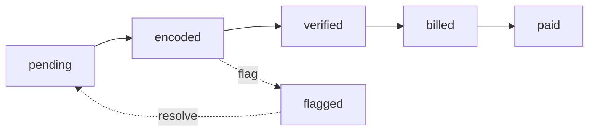

## Overview

The Meter Reader portal (`/meter-reader/`) is the operational hub for water consumption tracking in the Roxas Water Billing System. Meter readers are responsible for encoding monthly meter readings, verifying consumption data, and generating bills for client payment. This role ensures accurate billing based on actual water usage.

<CardGroup cols={2}>
  <Card title="Encode Readings" icon="keyboard">
    Enter current and previous meter readings for active clients
  </Card>
  <Card title="Verify Readings" icon="check-circle">
    Review encoded data, calculate consumption, and validate accuracy
  </Card>
  <Card title="Bill Generation" icon="file-invoice">
    Create billing statements and email them to clients
  </Card>
  <Card title="Reading History" icon="clock-rotate-left">
    Access historical meter readings and consumption patterns
  </Card>
</CardGroup>

## Core Responsibilities

### 1. Encode Meter Readings

**Location**: `encode_meter_reading.php`

Record monthly meter readings for all active clients:

#### Encoding Workflow

<Steps>
  <Step title="Select Client">
    View list of clients with reading_status `pending` (ready for monthly reading)
  </Step>
  <Step title="Enter Reading Data">
    Input current meter reading and previous meter reading
  </Step>
  <Step title="Add Notes (Optional)">
    Record any irregularities, meter issues, or special conditions
  </Step>
  <Step title="Submit Reading">
    System validates data and updates billing record
  </Step>
  <Step title="Move to Verification">
    Reading status changes to `encoded`, ready for verification step
  </Step>
</Steps>

**Reading Data Fields**:
- **Client ID**: Auto-populated from client selection
- **Meter Number**: Display only (from client record)
- **Current Reading**: Meter value at end of billing period
- **Previous Reading**: Meter value at start of billing period (auto-filled from last billing)
- **Reading Date**: Automatically recorded
- **Encoder**: Meter reader user ID (auto-recorded)
- **Notes**: Optional field for comments

<Note>
The system automatically retrieves the previous reading from the last billing cycle. Meter readers should verify this value matches the meter's last recorded reading.
</Note>

### 2. Verify Meter Readings

**Location**: `verify_meter_reading.php`

Review and validate encoded readings before bill generation:

#### Verification Workflow

<Steps>
  <Step title="Review Encoded Readings">
    View list of readings with status `encoded` awaiting verification
  </Step>
  <Step title="Calculate Consumption">
    System displays: Current Reading - Previous Reading = Consumption (m³)
  </Step>
  <Step title="Validate Accuracy">
    Check for unusual consumption patterns or data entry errors
  </Step>
  <Step title="Flag Issues (If Needed)">
    Use "Flag Client" feature for unusually high/low consumption requiring investigation
  </Step>
  <Step title="Verify and Generate Bill">
    Confirm reading accuracy and trigger bill generation
  </Step>
  <Step title="Email Bill to Client">
    System automatically sends billing statement PDF via email
  </Step>
</Steps>

<Warning>
**Consumption Validation**: Always verify that consumption values are reasonable for the property type. Unusually high readings may indicate leaks or meter issues. Unusually low readings may indicate meter malfunction.
</Warning>

**Verification Checks**:
- ✅ Current reading > Previous reading
- ✅ Consumption within expected range for property type
- ✅ No meter number discrepancies
- ✅ Reading date is current billing month
- ⚠️ Flag if consumption is > 2x average
- ⚠️ Flag if consumption is < 25% of average

### 3. Bill Generation

**Location**: `bill_generation.php`, `bill_handler.php`

Generate billing statements from verified readings:

#### Bill Calculation Process

<CodeGroup>
```php Bill Calculation Logic
Consumption = Current Reading - Previous Reading

// Get rate for property type
$rate = getRateForPropertyType($propertyType);

// Base billing amount
$billingAmount = $consumption * $rate;

// Add penalties if applicable
$penalty = calculatePenalty($clientID, $dueDate);

// Calculate tax (12%)
$tax = $billingAmount * 0.12;

// Total amount due
$totalDue = $billingAmount + $penalty + $tax;
```
</CodeGroup>

**Billing Statement Contents**:
- Client information (name, address, meter number)
- Billing period (from date - to date)
- Billing month and year
- Previous reading
- Current reading  
- Consumption (in m³)
- Rate per m³ (property type specific)
- Base billing amount
- Penalty charges (if applicable)
- Tax (12%)
- Total amount due
- Due date
- Payment instructions

**Billing Types**:
- `initial`: First bill for new client (no previous consumption)
- `billed`: Regular monthly bill based on meter reading
- `paid`: Bill has been paid by client

### 4. Flag Client Feature

**Location**: `encode_meter_reading.php` (modal: `flag_client_modal.php`)

Mark clients with unusual consumption for investigation:

**Flag Reasons**:
- Unusually high consumption
- Unusually low consumption  
- Suspected meter malfunction
- Suspected leak
- No access to meter
- Meter obstruction
- Other (with notes)

<Info>
Flagged clients appear in the admin's Meter Reports for follow-up investigation and potential site visits.
</Info>

### 5. Recent Meter Readings

**Location**: `recent_meter_reading.php`

View historical reading data:

**Display Information**:
- Client details
- Reading dates
- Previous and current readings
- Consumption amounts
- Billing status
- Encoder information
- Verification status

**Filters**:
- Date range
- Client ID
- Barangay
- Property type
- Reading status

## Reading Status Lifecycle



**Status Definitions**:
- `pending`: Client ready for meter reading this cycle
- `encoded`: Reading entered but not yet verified
- `verified`: Reading validated and ready for billing
- `billed`: Bill generated and sent to client
- `paid`: Client has paid the bill
- `flagged`: Issue identified, requires investigation

## Billing Email System

**Location**: Uses `WBSMailer` class in `bill_handler.php`

Automatic email delivery of billing statements:

<CodeGroup>
```php bill_handler.php
public function sendIndividualBilling()
{
    // Generate billing PDF
    $pdfGenerator = new PdfGenerator($this->conn);
    $billingPDF = $pdfGenerator->generateBillingStatement($clientID, $billingID);
    
    // Prepare email
    $mail = new PHPMailer(true);
    $mail->setFrom('roxaswaterbillingsystem@gmail.com', 'Roxas Water Billing System Inc.');
    $mail->addAddress($clientEmail, $clientName);
    $mail->Subject = 'Water Billing Statement - ' . $billingMonth;
    $mail->Body = 'Please find your water billing statement attached.';
    $mail->addAttachment($billingPDF);
    
    // Send email
    $mail->send();
}
```
</CodeGroup>

<Tip>
Billing PDFs are generated using the Dompdf library and stored temporarily in `temp/billing/` before being emailed and cleaned up.
</Tip>

## Client Profile Access

**Location**: `client_profile.php`

Meter readers can view client details needed for reading operations:

**Viewable Information**:
- Client ID and registration ID
- Full name and contact information
- Property address and barangay
- Meter number
- Property type (Residential/Commercial)
- Account status
- Reading history

<Note>
Meter readers have **read-only** access to client profiles. They cannot modify client information.
</Note>

## Dashboard Overview

**Location**: `dashboard.php`

The meter reader dashboard provides operational metrics:

- Total pending readings
- Total encoded readings (awaiting verification)
- Total verified readings (ready for billing)
- Recent activity log

## Data Tables

### Encode Reading Table

Displays clients needing meter readings:
- Client ID
- Client name
- Meter number
- Address
- Last reading date
- Last consumption
- **Action**: "Encode" button

**Filter**: `reading_status = 'pending'`

### Verify Reading Table

Displays encoded readings for verification:
- Billing ID
- Client name
- Previous reading
- Current reading
- Consumption (calculated)
- Reading date
- Encoder name
- **Actions**: "Verify" or "Flag" buttons

**Filter**: `reading_status = 'encoded'`

## Receipt Generation

**Location**: `receipt.php`, `billing-pdf.php`

Meter readers can regenerate billing statements if needed:

- Select client and billing period
- System retrieves billing data
- PDF regenerated from stored data
- Can be re-emailed or printed

## Access & Permissions

<Warning>
**Reading-Only Operations**: Meter readers cannot modify rates, approve applications, or access financial reports. Their scope is limited to meter reading operations.
</Warning>

**Meter Reader Permissions**:
- ✅ View client list with pending readings
- ✅ Encode meter readings
- ✅ Verify encoded readings
- ✅ Generate bills from verified readings
- ✅ Email bills to clients
- ✅ Flag clients for investigation
- ✅ View reading history
- ✅ Access client profiles (read-only)
- ✅ Update own profile
- ❌ Modify client information
- ❌ Change billing amounts or rates
- ❌ Delete readings or bills
- ❌ Approve payments
- ❌ Access financial reports

## Navigation Structure

**Main Menu**:
- Encode (meter reading entry)
- Verify (reading verification)
- History (recent readings)

**Settings**:
- User Profile

## Best Practices

<Check>
**Double-Check Readings**: Always verify meter readings before submission. Incorrect readings lead to billing disputes.
</Check>

<Tip>
**Photo Documentation**: Consider taking photos of meters during reading for dispute resolution (if system enhancement is added).
</Tip>

<Warning>
**Verify Before Bill**: Always verify readings before generating bills. Once a bill is emailed, corrections require manual intervention.
</Warning>

## Reading Schedule

Typical monthly reading cycle:

1. **Days 1-10**: Encode meter readings for all clients
2. **Days 11-15**: Verify all encoded readings
3. **Day 15**: Generate and email bills
4. **Days 16-30**: Bills are due for payment
5. **Day 1 (next month)**: Cycle repeats

<Info>
The system tracks `period_from` and `period_to` dates for each billing cycle, typically spanning the full month.
</Info>

## Error Handling

**Common Issues**:

1. **Invalid Reading**: "Current reading must be greater than previous reading"
   - **Solution**: Verify meter value. Check if meter has been replaced.

2. **Duplicate Encoding**: "Reading already exists for this billing period"
   - **Solution**: Check recent readings. Use verify page to review existing reading.

3. **Email Failure**: "Failed to send billing statement"
   - **Solution**: Bill is still generated. Verify client email address and retry from receipt page.

4. **No Rate Configured**: "No rate found for property type"
   - **Solution**: Contact administrator to configure rate for the property type.

## Technical Details

**Reading Data Flow**:
1. Client status set to `reading_status = 'pending'`
2. Meter reader encodes reading → status changes to `'encoded'`
3. Verification performed → status changes to `'verified'`
4. Bill generated → `billing_status = 'billed'`, `billing_type = 'billed'`
5. Payment confirmed → `billing_status = 'paid'`, `billing_type = 'paid'`
6. New billing cycle → status resets to `'pending'`

**Database Tables**:
- `billing_data`: Stores readings, consumption, billing amounts
- `client_data`: Client information and reading status
- `rates`: Current rates by property type
- `penalty_fees`: Late payment and reconnection fees

**Session Data**:
- `user_id`: Meter reader identifier (recorded as encoder)
- `user_name`: Display name
- `user_role`: "meter reader" role designation

## Integration Points

**With Admin Portal**:
- Flagged clients appear in admin's Meter Reports
- Administrators can view all readings and encoders
- Rate changes by admin immediately affect new bills

**With Cashier Portal**:
- Bills generated by meter readers appear in cashier's payment queue
- Payment confirmation updates `billing_status` to 'paid'

## Keyboard Shortcuts

<Tip>
For efficient data entry, use Tab to navigate between reading fields and Enter to submit forms.
</Tip>